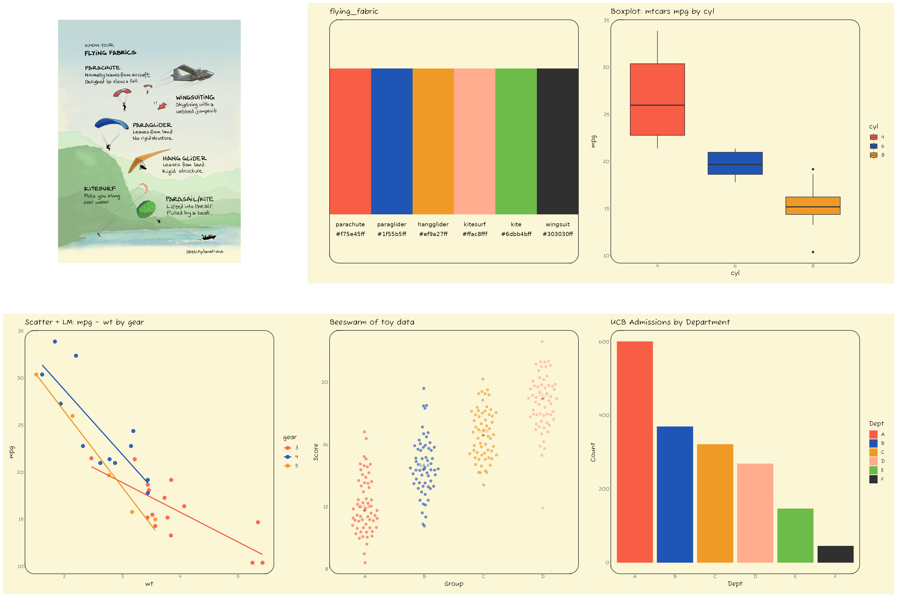

<!-- README.md is generated from README.Rmd. Please edit that file -->

# jonohey

<!-- badges: start -->

[](https://lifecycle.r-lib.org/articles/stages.html#experimental)
<!-- badges: end -->

The goal of jonohey is to provide color palettes inspired by Jono Hey’s
sketches at [Sketchplanations](https://sketchplanations.com/).

<div class="callout">

These palettes were not selected following criteria of color theory or
accessibility. You might find that separability is not grat, especially
when the number of colors is large. These palettes are intended for fun
and to add a sketchy aesthetic to your visualizations. Use what works,
toss the rest. Cution advised in professional settings!

</div>

## Installation

You can install the development version of jonohey from
[GitHub](https://github.com/matiasandina/jonohey) with:

``` r
# install.packages("pak")
pak::pak("matiasandina/jonohey")
```

## Example

These examples display the color palettes themselves. For utilization of
the package, check [the docs](matiasandina.github.io/jonohey/) 📖.

``` r
library(jonohey, quietly = TRUE)
library(patchwork)
library(ggplot2)

plot_box_mtcars <- function(palette_name) {
  d <- transform(mtcars, cyl = factor(cyl))
  ggplot(d, aes(cyl, mpg, fill = cyl)) +
    geom_boxplot(width = 0.7) +
    scale_fill_jonohey(palette_name) +
    labs(title = "Boxplot: mtcars mpg by cyl") 
}

plot_box_mtcars("suit")
```


We provide themes to make this plot a bit more interesting (and closer
in nature to their true sketch identity!).

``` r
# make a round panel!
plot_box_mtcars("suit") + theme_card(radius_panel = 18)
```


> Typography matches exactly in saved figures or Rmd configured with
> `dev = "ragg_png"`. For interactive plotting,
> `call jonohey_use_ragg()` or install Fuzzy Bubbles system-wide.

``` r
# Make it more cartoonish
plot_box_mtcars("suit") + theme_axes_wiggle()
```


Check 📖 [the docs](matiasandina.github.io/jonohey/)!

### Palettes

We display available palettes with some toy examples below

### autumn

Below is the showcase for the **autumn** palette.

You can find the source for the sketch inspiring the palette at
[Sketchplanations](https://sketchplanations.com/autumn-leaves)

------------------------------------------------------------------------


------------------------------------------------------------------------

### color_wheel

Below is the showcase for the **color_wheel** palette.

You can find the source for the sketch inspiring the palette at
[Sketchplanations](https://sketchplanations.com/the-basic-colour-wheel)

------------------------------------------------------------------------


------------------------------------------------------------------------

### flying_fabric

Below is the showcase for the **flying_fabric** palette.

You can find the source for the sketch inspiring the palette at
[Sketchplanations]()

------------------------------------------------------------------------



------------------------------------------------------------------------

### landlocked

Below is the showcase for the **landlocked** palette.

You can find the source for the sketch inspiring the palette at
[Sketchplanations](https://sketchplanations.com/double-landlocked-countries)

------------------------------------------------------------------------


------------------------------------------------------------------------

### suit

Below is the showcase for the **suit** palette.

You can find the source for the sketch inspiring the palette at
[Sketchplanations](https://sketchplanations.com/60-30-10-colour-rule)

------------------------------------------------------------------------


------------------------------------------------------------------------

### surfing

Below is the showcase for the **surfing** palette.

You can find the source for the sketch inspiring the palette at
[Sketchplanations]()

------------------------------------------------------------------------


------------------------------------------------------------------------

There are two palettes without associated images: “light” and “dark”.
They contain 9 colors each, in light and dark tones respectively.

``` r
jonohey_show("light")
```


``` r
jonohey_show("dark")
```


These palettes have 9 colors, which can be useful for plotting
categorical data with many levels.

``` r
p_bar <- dplyr::storms  |> 
  dplyr::count(status) |>
  dplyr::mutate(status = forcats::fct_reorder(status, n, .desc = TRUE)) |>
  ggplot(aes(n, status, fill=status)) + 
  geom_col(show.legend = FALSE, color = "black") +
  theme_card(base_size = 12, radius_panel = 10)

xy_summ <- dplyr::storms |> 
  dplyr::group_by(status) |> 
  dplyr::summarise(
    n = dplyr::n(),
    wind_mean = mean(wind, na.rm = TRUE),
    wind_sd   = sd(wind,   na.rm = TRUE),
    pres_mean = mean(pressure, na.rm = TRUE),
    pres_sd   = sd(pressure,   na.rm = TRUE),
    .groups = "drop"
  ) |> 
  dplyr::mutate(
    wind_ci = qt(0.999, df = pmax(n - 1, 1)) * wind_sd / sqrt(n),
    pres_ci = qt(0.999, df = pmax(n - 1, 1)) * pres_sd / sqrt(n),
    xmin = wind_mean - wind_ci, xmax = wind_mean + wind_ci,
    ymin = pres_mean - pres_ci, ymax = pres_mean + pres_ci
  )

p <- ggplot(xy_summ, aes(wind_mean, pres_mean, fill = status)) +
  geom_point(size = 3, pch = 21) +
  geom_errorbar(aes(ymin = ymin, ymax = ymax, color = status), width = 0, show.legend = FALSE) +
  geom_errorbarh(aes(xmin = xmin, xmax = xmax, color = status), height = 0, show.legend = FALSE) +
  theme_card(base_size = 12, , radius_panel = 10) +
  labs(x = "Wind", y = "Pressure", color = "Status") +
  theme(legend.position = "none",
  )


p_bar + 
  scale_fill_jonohey("light") +
  labs(title = "Using the 'light' palette in dplyr::storms data") +
p + 
  scale_fill_jonohey("light") +
  scale_color_jonohey("light")
```


``` r
p_bar + 
  scale_fill_jonohey("dark") +
  labs(title = "Using the 'dark' palette in dplyr::storms data") +
p + 
  scale_fill_jonohey("dark") +
  scale_color_jonohey("dark") 
```


## Using ragg for consistent typography

Since we provide a custom font (“Fuzzy Bubbles”) to match a sketchy
look, we recommend using the `ragg` graphics device for saving plots to
ensure consistent typography. You can do this by calling
`jonohey_use_ragg()` once in your R session, or by specifying
`dev = "ragg_png"` in your R Markdown document’s chunk options.

In Rstudio, you can also set `ragg` as the default graphics device in
the Global Options under the “General” section. Check the [Ragg’s
documentation](https://ragg.r-lib.org/index.html?q=rstu#use-ragg-in-rstudio)
for more details.

In Positron, it seems that `ragg` is used by default if ragg \>= 1.4
(see [this PR](https://github.com/posit-dev/ark/pull/763)). That’s why
we require ragg \>= 1.4 in the DESCRIPTION. We have tested
`jonohey_use_ragg()` and it seems to work, but the scaling is worse than
in RStudio.

## Issues

This is a preliminary release, file issues to improve the package.

## Acknowledgements

<div class="callout">

Shoutout to Jono Hey for the inspiration and permission to use his
sketches as a basis for color palettes!

You can find Jono Hey’s work at
[Sketchplanations](https://sketchplanations.com/).

</div>
