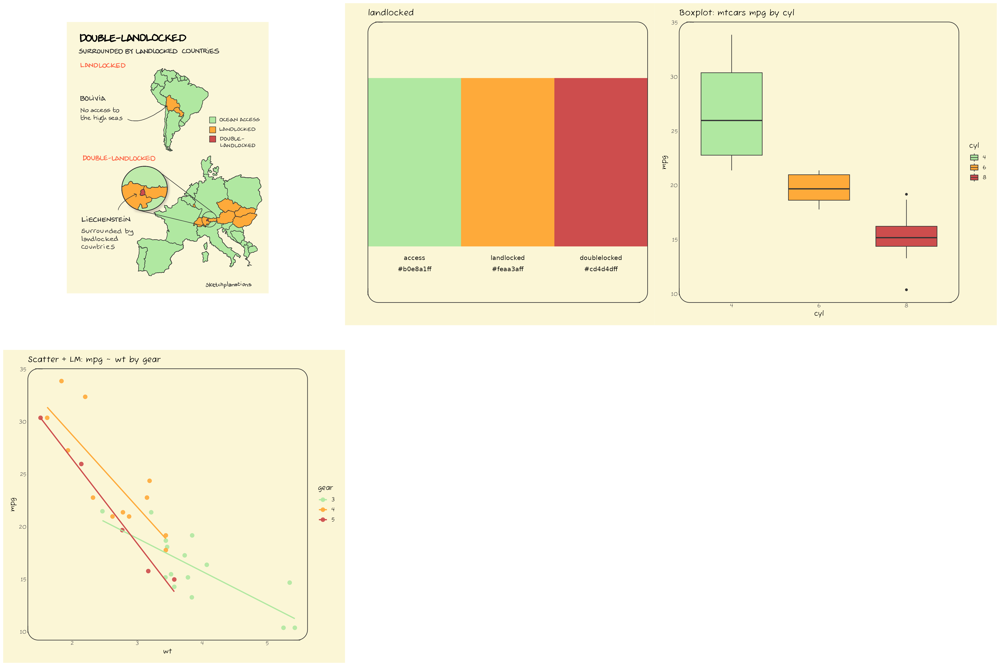
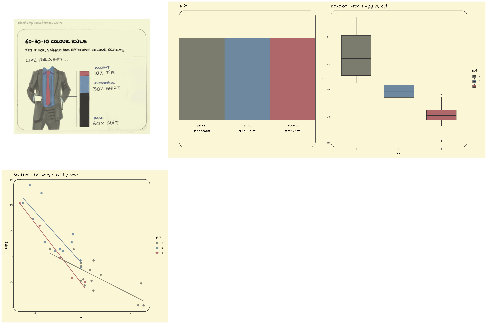

<!-- README.md is generated from README.Rmd. Please edit that file -->

# jonohey

<!-- badges: start -->

[](https://lifecycle.r-lib.org/articles/stages.html#experimental)
<!-- badges: end -->

The goal of jonohey is to provide color palettes inspired by Jono Hey’s
sketches at [Sketchplanations](https://sketchplanations.com/).

## Installation

You can install the development version of jonohey from
[GitHub](https://github.com/matiasandina/jonohey) with:

``` r
# install.packages("pak")
pak::pak("matiasandina/jonohey")
```

## Example

These examples display the color palettes themselves. For utilization of
the package, check [the docs](matiasandina.github.io/jonohey/) 📖.

``` r
library(jonohey)
library(patchwork)
library(ggplot2)

plot_box_mtcars <- function(palette_name) {
  d <- transform(mtcars, cyl = factor(cyl))
  ggplot(d, aes(cyl, mpg, fill = cyl)) +
    geom_boxplot(width = 0.7) +
    scale_fill_jonohey(palette_name) +
    labs(title = "Boxplot: mtcars mpg by cyl") 
}

plot_box_mtcars("suit")
```


We provide themes to make this plot a bit more interesting (and closer
in nature to their true sketch identity!).

``` r
# make a round panel!
plot_box_mtcars("suit") + theme_card(radius_panel = 18)
```


> Typography matches exactly in saved figures or Rmd configured with
> `dev = "ragg_png"`. For interactive plotting,
> `call jonohey_use_ragg()` or install Fuzzy Bubbles system-wide.

``` r
# Make it more cartoonish
plot_box_mtcars("suit") + theme_axes_wiggle()
```


Check 📖 [the docs](matiasandina.github.io/jonohey/)!

### Palettes

We display available palettes with some toy examples below

### autumn

Below is the showcase for the **autumn** palette.

You can find the source for the sketch inspiring the palette at
[Sketchplanations](https://sketchplanations.com/autumn-leaves)

------------------------------------------------------------------------


------------------------------------------------------------------------

### color_wheel

Below is the showcase for the **color_wheel** palette.

You can find the source for the sketch inspiring the palette at
[Sketchplanations](https://sketchplanations.com/the-basic-colour-wheel)

------------------------------------------------------------------------


------------------------------------------------------------------------

### flying_fabric

Below is the showcase for the **flying_fabric** palette.

You can find the source for the sketch inspiring the palette at
[Sketchplanations]()

------------------------------------------------------------------------


------------------------------------------------------------------------

### landlocked

Below is the showcase for the **landlocked** palette.

You can find the source for the sketch inspiring the palette at
[Sketchplanations](https://sketchplanations.com/double-landlocked-countries)

------------------------------------------------------------------------



------------------------------------------------------------------------

### suit

Below is the showcase for the **suit** palette.

You can find the source for the sketch inspiring the palette at
[Sketchplanations](https://sketchplanations.com/60-30-10-colour-rule)

------------------------------------------------------------------------



------------------------------------------------------------------------

### surfing

Below is the showcase for the **surfing** palette.

You can find the source for the sketch inspiring the palette at
[Sketchplanations]()

------------------------------------------------------------------------


------------------------------------------------------------------------

## Using ragg for consistent typography

Since we provide a custom font (“Fuzzy Bubbles”) to match a sketchy
look, we recommend using the `ragg` graphics device for saving plots to
ensure consistent typography. You can do this by calling
`jonohey_use_ragg()` once in your R session, or by specifying
`dev = "ragg_png"` in your R Markdown document’s chunk options.

In Rstudio, you can also set `ragg` as the default graphics device in
the Global Options under the “General” section. Check the [Ragg’s
documentation](https://ragg.r-lib.org/index.html?q=rstu#use-ragg-in-rstudio)
for more details.

In Positron, it seems that `ragg` is used by default if ragg \>= 1.4
(see [this PR](https://github.com/posit-dev/ark/pull/763)). That’s why
we require ragg \>= 1.4 in the DESCRIPTION. We have tested
`jonohey_use_ragg()` and it seems to work, but the scaling is worse than
in RStudio.

## Issues

This is a preliminary release, file issues to improve the package.
